# 職務経歴書

<p align="center">
  
</p>

<!-- START doctoc generated TOC please keep comment here to allow auto update -->
<!-- DON'T EDIT THIS SECTION, INSTEAD RE-RUN doctoc TO UPDATE -->

- [SNS情報](#sns%E6%83%85%E5%A0%B1)
- [概要](#%E6%A6%82%E8%A6%81)
- [メインスキル](#%E3%83%A1%E3%82%A4%E3%83%B3%E3%82%B9%E3%82%AD%E3%83%AB)
- [これまでの経験・実績](#%E3%81%93%E3%82%8C%E3%81%BE%E3%81%A7%E3%81%AE%E7%B5%8C%E9%A8%93%E3%83%BB%E5%AE%9F%E7%B8%BE)
- [貢献しやすいこと](#%E8%B2%A2%E7%8C%AE%E3%81%97%E3%82%84%E3%81%99%E3%81%84%E3%81%93%E3%81%A8)
- [貢献しにくいこと](#%E8%B2%A2%E7%8C%AE%E3%81%97%E3%81%AB%E3%81%8F%E3%81%84%E3%81%93%E3%81%A8)
- [条件面](#%E6%9D%A1%E4%BB%B6%E9%9D%A2)
- [キャリアタイムライン](#%E3%82%AD%E3%83%A3%E3%83%AA%E3%82%A2%E3%82%BF%E3%82%A4%E3%83%A0%E3%83%A9%E3%82%A4%E3%83%B3)
- [法人経歴](#%E6%B3%95%E4%BA%BA%E7%B5%8C%E6%AD%B4)
  - [2026/2 - 現在](#20262---%E7%8F%BE%E5%9C%A8)
- [フリーランス経歴](#%E3%83%95%E3%83%AA%E3%83%BC%E3%83%A9%E3%83%B3%E3%82%B9%E7%B5%8C%E6%AD%B4)
  - [2024/9 - 2026/1](#20249---20261)
  - [2024/2 - 2024/8](#20242---20248)
- [正社員経歴](#%E6%AD%A3%E7%A4%BE%E5%93%A1%E7%B5%8C%E6%AD%B4)
- [登壇](#%E7%99%BB%E5%A3%87)
- [執筆](#%E5%9F%B7%E7%AD%86)

<!-- END doctoc generated TOC please keep comment here to allow auto update -->

## SNS情報

```json
{
  "FullName": "萩原圭市(Keiichi Hagiwara)",
  "Facebook": "https://www.facebook.com/hagyyyy1992",
  "Wantedly": "https://www.wantedly.com/id/hagyyyy"
}
```

## 概要

2017年からエンジニアをしています。<br>
業務系Webアプリケーションを中心に、バックエンドを主軸としたフルスタック開発に対応してきました。既存基盤運用からモダン技術まで対応実績があります。<br>
介護管理システムにおける介護報酬計算などの複雑な業務ロジック実装、大規模データ処理のパフォーマンス最適化に加え、採用プラットフォームにおけるベクトル類似検索を用いた不正検知機能やAIフィードバック機能の実装経験も有しています。<br>
直近ではClaude Code（AIエージェント）を活用したAI駆動開発により、バックエンドエンジニア1人で大規模リニューアルを推進する開発スタイルを実践しています。カスタムスキル開発やマルチエージェント並行開発を通じて、開発ワークフロー全体の効率化も推進しています。<br>
正社員時代はPMの立ち回りや採用などもやってました。2021年からフリーランスとして独立し、2025年5月に[Hagyyyy株式会社](https://hagyyyy.com/)を設立。2026年2月より法人としての取引を本格開始しています。

## 経験スキル

**バックエンド**

<a href="https://www.typescriptlang.org/"></a>
<a href="https://expressjs.com/"></a>
<a href="https://nestjs.com/"></a>
<a href="https://www.python.org/"></a>
<a href="https://fastapi.tiangolo.com/"></a>
<a href="https://www.php.net/"></a>
<a href="https://laravel.com/"></a>
<a href="https://cakephp.org/"></a>

**フロントエンド**

<a href="https://react.dev/"></a>
<a href="https://nextjs.org/"></a>
<a href="https://vuejs.org/"></a>
<a href="https://nuxt.com/"></a>
<a href="https://svelte.dev/"></a>

**DB/データ**

<a href="https://www.mysql.com/"></a>
<a href="https://www.prisma.io/"></a>
<a href="https://www.mongodb.com/"></a>

**AI/ML**

<a href="https://openai.com/"></a>
<a href="https://qdrant.tech/"></a>

**インフラ/運用**

<a href="https://www.docker.com/"></a>
<a href="https://aws.amazon.com/"></a>
<a href="https://www.terraform.io/"></a>
<a href="https://sentry.io/"></a>

**テスト/品質**

<a href="https://playwright.dev/"></a>
<a href="https://jestjs.io/"></a>

**AI駆動開発**

<a href="https://docs.anthropic.com/en/docs/claude-code"></a>
<a href="https://git-scm.com/docs/git-worktree"></a>

## これまでの経験・実績

- 要望を同期的/非同期的にヒアリングして仕様を整理し、詳細設計からTDDでの実装まで一気通貫で対応
- 0→1のプロダクト立ち上げから運用まで主担当として推進した経験
- PHP/JavaScript/TypeScript/Pythonを用いた開発経験
- テスト基盤のゼロからの構築（Jest・Playwright E2E CI）
- フロントエンド、バックエンド、インフラまで幅広いレイヤーの経験
- SOLID原則・クリーンアーキテクチャに基づいた設計（トランザクション管理の抽象化レイヤー等）
- 大規模CSVデータ処理（数十万行）のバッチ処理設計・パフォーマンス最適化
- チームマネジメントを行いチームビルディング,ビジネスサイドとの調整などをしてきた経験
- スクラムの導入・運用、チームビルディング、エンジニア採用の経験
- Wantedly、SNS、 勉強会、リファラルなどあらゆる手段から採用してチームを作った経験
- Claude Codeのカスタムスキル群の設計・開発を通じた開発ワークフロー全体の効率化
- セキュリティインシデント対応（調査・除去・再発防止策の策定）

## 貢献しやすいこと

- TypeScript/Pythonでのバックエンド開発
- Claude Code活用によるAI駆動開発での高速デリバリー
- DB設計・プロダクト仕様などの詳細設計
- 仕様未定義状態からの要件定義
- 新規アプリの0→1構築からMVP構築

## 貢献しにくいこと

以下は経験がないわけではないですが専門ではないです。<br>
AIツールを活用しながらの対応は可能です。

- AWS/GCPなどクラウドインフラ基盤構築や改善提案
- Docker/Kubernetes(k8s)などコンテナ基盤構築や改善提案
- セキュリティやネットワーク周りの専門性が必要なタスク
- iOS/Android/Desktopアプリの開発
- PHP/TypeScript/Python以外の技術スタックでの開発

## 条件面

Hagyyyy株式会社としての法人契約（準委任契約）、フルリモートで対応しています。<br>
より具体的な条件はコメントアウトに記載しました。

<!--  
  希望単価: 時給10,000円 or 月960,000円（週3日）
  下限単価: 時給8,000円 or 月768,000円（週3日）
  ※1日8h, 週3日（月約96h）稼働。土日いれて週5稼働は相談可。

  現在の稼働状況:
  - 既存案件: 週2日（準委任契約）
  - 新規案件に割ける稼働: 週3日（平日）

  根拠:
  - 過去の取引実績: 時給5,000→5,500円→6,000円→6,500円→8,000円（2021年個人事業主開始から）
  - 直近実績: 時給8,000円
  - AI駆動開発: Claude Code活用で1人2ヶ月100PR以上・25万行書き換え（従来比5〜10倍）
  - バックエンド主軸でありながらフロントエンド・セキュリティ監査・インフラドキュメントまで1人でカバー
  - 法人契約のため社会保険・経費等のオーバーヘッドを含む
-->

## キャリアタイムライン

```
2026 ━━ 💼 採用プラットフォームSaaS - フルリメイク開発支援
  │       ── Hagyyyy株式会社設立 ──
  │
2024 ━━ 💼 介護AI SaaS - バックエンド開発支援
  │
2023 ━━ 💼 ナレッジ経営SaaS / IPO支援SaaS
  │
2022 ━━ 💼 カスタマーサクセスSaaS / 店舗接客SaaS / 空き情報プラットフォームSaaS
  │
2021 ━━ 💼 リモートワークSaaS / 店舗情報管理SaaS / 外国人留学生キャリアプラットフォームSaaS / 水産業支援SaaS
  │       ── フリーランス独立 ──
  │
2020 ━━ 🏢 合同会社DMM.com - オンラインサロンプラットフォーム
  │
2018 ━━ 🏢 GVA TECH株式会社 - 法人登記書類作成支援システム
  │
2017 ━━ 🏢 株式会社ROBOT PAYMENT - 請求管理クラウドシステム
```

## 法人経歴

### 2026/2 - 現在

- 案件内容
  - 採用プラットフォームの大規模リニューアル・機能開発・運用
- 業務内容
  - 採用プラットフォームの大規模リニューアルに、AIエージェントを活用したAI駆動開発で推進
  - ナビサイト全面リニューアル
    - マルチカテゴリ対応、エントリーフロー改善、マイページ改善
    - 既存機能の復元と最新仕様への刷新
    - アニメーションUIでフルリメイク
    - 検索結果ページのスプリットビュー化
  - ブロックエディタの設計・実装
    - 方針未定の段階で複数手法をリサーチし、動作するプロトタイプを構築・提示して方向性を確定
    - ブロックタイプ対応
    - リッチテキストからブロックエディタへのデータ移行スクリプト設計・実装
  - ロープレ機能
    - 複数のAIアバターサービスを技術検証し、最適なサービスを選定・統合
    - AIアバターによるリアルタイム対話体験の設計・実装
  - Node/Nuxt メジャーバージョン移行
  - 不正検知機能の設計・実装
    - OpenAI APIによるテキストembedding生成
    - コサイン類似度によるベクトル類似検索
    - 多段階閾値による検知ロジック設計
  - AIフィードバック機能（LLM連携によるフィードバック生成）
  - テスト基盤構築
    - Jest ユニットテスト追加
    - Playwright E2E CI構築（マルチブラウザ対応）
  - セキュリティ監査・改善
    - OWASP Top 10準拠のセキュリティレビュー
    - レッドチーム分析（攻撃者視点での脆弱性洗い出し）
    - 個人情報保護法・外部送信規律への準拠設計
    - HTMLサニタイズ基盤構築、NoSQLインジェクション対策
    - セキュリティ監査対応
  - Claude Codeカスタムスキル開発
    - マージ・デプロイ・TDD・動作確認等のワークフロー効率化ツール群の設計・構築
    - マルチエージェント並行開発、worktreeを活用したブランチ分離開発
    - AIによるコードレビュー自動化で、1人開発でも品質を担保
  - 本番運用
    - HOTFIX対応（本番障害の迅速な修正・デプロイ）
    - Sentryエラートラッキングに基づくプロアクティブなバグ修正
    - インフラ・DB運用ドキュメント整備（構成図・バックアップ手順・全コレクション定義書等）
  - 約2ヶ月で100PR以上
- 使用技術、言語、フレームワーク
  - Nuxt 4
  - Vue 3 (Composition API)
  - TypeScript
  - Express
  - Mongoose (MongoDB)
  - OpenAI API
  - Playwright
  - Jest
  - Canvas API
  - Claude Code

## フリーランス経歴

### 2024/9 - 2026/1

- 案件内容
  - 介護領域特化のAI支援SaaSの開発支援
- 業務内容
  - 介護医療事業所向けの請求管理・事務効率化サービスの開発支援
    - 独自介護システム連携ロジックの実装
    - 請求管理、帳票出力
    - バックエンド/フロントエンドの改善
    - 新規APIの設計と実装、APIとフロントの繋ぎ込み、UI実装
    - PDFをアップロードして保存、保存したPDFを請求書に添付、設定画面で確認できる機能
    - 入金情報を登録する機能
      - csv/txtアップロード
      - 全銀フォーマットの解析など
    - 事業所利用者のイベント管理機能
      - 要求要件整理、DB設計、API開発、画面繋ぎこみ、一部UI実装
      - イベントのCRUD
      - スケジュールのカレンダー機能(Like Google Calendar)
      - イベントのスケジュールごとの参加者のCRUD
      - 参加イベントの請求の仕訳の実装
    - パフォーマンス改善
      - N+1問題解消
      - 複雑なトランザクション管理のための設計改善
    - SOLID原則・クリーンアーキテクチャに基づいた設計
- 使用技術、言語、フレームワーク
  - TypeScript
  - NestJS
  - GraphQL
  - React
  - Next.js
  - Prisma
  - Clean Architecture

### 2024/2 - 2024/8

- 案件内容
  - 介護領域特化のAI支援SaaSの開発支援
- 業務内容
  - 介護医療領域に特化した求人サービスの開発支援
    - 新規プロダクトの立ち上げ開発
      - DB設計
      - Python、Selenium、Beautiful Soupでのスクレイピングロジック実装
      - OpenAI API、Qdrantを活用したデータ検索処理実装
      - LINE APIを活用したUI修正
      - テストコードの実装
      - プロダクトの仕様策定のためのMTGのファシリテーションやまとめなど
    - プロダクトに必要な運用の提案など
      - ログのモニタリング
      - デプロイフローの自動化
      - Prisma ERD導入
    - バッチ処理の実装
      - Python、FastAPI、sqlalchemy、pydanticでデータモデルの定義
      - localstack, Boto3, Pandasを用いたS3からの数十万行のCSV解析処理
      - 定義したデータモデルのテストコード
    - PRレビューや仕様のドキュメント整理など
- 使用技術、言語、フレームワーク
  - Python
  - FastAPI
  - TypeScript
  - NestJS
  - React
  - Next.js
  - GraphQL
  - Prisma
  - Tailwind CSS
  - OpenAI API
  - LINE Message API
  - Qdrant
  - Selenium
  - Beautiful Soup
  - Clean Architecture
  - Argo CD
  - Grafana
  - Datadog

<details>
<summary>2022/11 - 2024/1 | ナレッジ経営SaaS</summary>

- 業務内容
  - 軽微なUIUX修正
  - データ移行が必要な機能修正
  - 既存機能を模倣した新機能追加
  - 外部システム連携機能
    - Teams Graph APIを使った機能実装
  - リファクタリング
    - 設計方針に基づきコード修正など
  - 機能改善
    - 管理者権限設計の変更に基づく機能変更など
  - 匿名投稿機能の設計・実装（匿名ユーザーの投稿・リアクション・アクティビティ整合性の維持）
  - DDD/Value Objectによるドメインモデルのリファクタリング（UserPostAggregate設計、UserIdをValue Object化）
  - ヘッダー通知機能のGraphQL・UseCaseレイヤー実装
  - タイムゾーン対応（RFC3339形式による日時標準化）
  - アクションログダウンロードのストリーム処理・エラーハンドリング実装
  - パフォーマンス改善（N+1問題・2重ループのSQL最適化）
  - 不具合修正など
- 使用技術、言語、フレームワーク
  - Python
  - TypeScript
  - React
  - Node.js
  - Next.js
  - NestJS
  - GraphQL
  - apollo

</details>

<details>
<summary>2023/2 - 2023/4 | IPO支援SaaS</summary>

- 業務内容
  - バックエンドAPIを用いて新規画面UIの構築
- 使用技術、言語、フレームワーク
  - Svelte
  - Svelte Kit
  - typescript

</details>

<details>
<summary>2022/3 - 2023/6 | カスタマーサクセスSaaS</summary>

- 職務
  - バックエンドエンジニア
- 業務内容
  - Slack連携して通知できる機能
  - エンドユーザー画面で投稿されたものを承認却下できる機能
  - あらゆる箇所でハードコードされているものを動的にカスタマイズできる機能
  - マークアップエディターの動作修正（DOM周り）
  - デザインに基づいてUIマークアップ
  - Xdebug導入
- 使用技術、言語、フレームワーク
  - PHP 7.4
  - Laravel 6系
  - Vue.js 2系

</details>

<details>
<summary>2022/7 - 2022/10 | リアルタイム空き情報プラットフォームSaaS</summary>

- 職務
    - バックエンドエンジニア
- 業務内容
  - CSVで管理されているデータをスクリプトでSQLを作り一括で登録できるようにする
  - 要望に基づき管理画面のUI/UX/API修正
- 使用技術、言語、フレームワーク
    - Typescript
    - Vue.js
    - Node.js

</details>

<details>
<summary>2022/5 - 2022/10 | 店舗接客マネジメントSaaS</summary>

- 職務
  - バックエンドエンジニア
- 業務内容
  - 要望に基づき既存機能のUI/UX/API改善
  - S3上のデータを移動させるスクリプト
  - S3パスが保存されているテーブルをマイグレートするスクリプト作成
- 使用技術、言語、フレームワーク
    - PHP 8.0
    - CakePHP 2系
    - Vue.js 2系
    - Typescript

</details>

<details>
<summary>2021/11 - 2022/2 | 水産業支援SaaS</summary>

- 職務
  - アプリ開発
  - バックエンドエンジニア
  - DevOps
- 業務内容
  - ネイティブアプリの機能開発
    - ユーザー情報変更機能
  - DevOps
    - テストコード導入
    - CI環境構築
- 使用技術、言語、フレームワーク
  - TypeScript
  - React Native
  - Firebase

</details>

<details>
<summary>2021/1 - 2021/12 | リモートワークSaaS</summary>

- 職務
  - フロントエンドエンジニア
  - バックエンドエンジニア
  - スクラムマスター
- 業務内容
  - 新規機能開発
    - Slack連携機能
    - 個別DM機能
    - ユーザーがカスタマイズしたステータスを設定できる機能
    - 他ユーザーが設定したトピックに興味ありして通知を受け取る機能
    - 通信のログを使って電波の状況を表示する機能
    - Slack通知からWebページの適切な画面に移動する修正
  - 開発フローに関する提言や実施サポート
    - テスト仕様書作成
    - リリース前のテスト実施など
  - チームビルディング
    - スプリントテスト実施導入
    - レトロ実施導入
  - スクラム導入・運用
    - スクラム説明資料作成・説明
    - ディレクション
  - 技術的課題についてイシュー化
    - インフラ基盤・使用言語のリプレイスについて
    - 技術的負債の解消など
    - 保守運用コスト・組織スケール・採用難易度などの観点で議論
- 使用技術、言語、フレームワーク
  - Vue.js
  - Node.js
  - Firebase

</details>

<details>
<summary>2021/10 - 2021/12 | 店舗情報一括管理SaaS</summary>

- 職務
  - バックエンドエンジニア
- 業務内容
  - 不具合・要望対応
  - パフォーマンスを落としているクエリのチューニングやインデックスの追加など
- 使用技術、言語、フレームワーク
  - PHP
  - Laravel

</details>

<details>
<summary>2021/6 - 2021/9 | グローバル学生就活オンラインサービス リメイク</summary>

- 職務
  - フロントエンドエンジニア
  - バックエンドエンジニア
- 業務内容
  - 機能開発
    - 画面マークアップ実装
    - 投稿詳細フロントエンド、バックエンド実装
    - ログインメールアドレス、パスワード変更機能
    - 通知設定変更機能
- 使用技術、言語、フレームワーク
  - TypeScript
  - Nuxt.js
  - PHP
  - Laravel

</details>

## 正社員経歴

<details>
<summary>2020/5 - 2021/8 | 合同会社DMM.com - オンラインサロン</summary>

- 職務
  - Webエンジニア
  - バックエンドエンジニア
- 主な業務内容
  - 仕様変更を伴う機能改修
  - フロントエンド側、バックエンド側の両方の改修が必要な不具合修正
  - ログやソース、DB調査が必要な不具合調査
  - 不具合報告、問い合わせ対応
  - 定期的な手動でのデータ更新や深夜メンテナンスなど
  - スクラムでのアジャイル開発
- 主な実績
  - 新規機能開発のためBiz,Design,Dev,POなどを巻き込んだプロジェクト進行
  - 特殊な手動方法にて行われていた環境構築を自動化するためMakefileでの環境構築自動化
  - Xdebugの導入と使い方共有ドキュメント化
  - 既存のDBスキーマからリバースエンジニアリングにてDB定義書の作成
  - マイクロサービスにおける認証・認可サービスのベストプラクティスのリサーチと設計
  - 会社主催のオンラインイベントにてマイクロサービス化の取組発表
  - スクラム開発におけるファシリテーション(レトロスペクティブなど)
  - チームとして生産性を上げていくためのペアプロ・モブプロの提案と実施
  - 安定性の高いプロダクトを保つためチームとしてテストを毎スプリント回す体制の提案と実施
  - PHPStormなどのIDEのより効果的な使い方の共有やドキュメント化
- 使用技術、言語、フレームワーク
  - フロントエンド HTML CSS(Sass) TypeScript(React) Node.js
  - バックエンド PHP(Laravel,ZendFramework),Golang
  - データベース MySQL
  - 開発環境 Docker
  - インフラ AWS EC2 EB
- 特に業務でメインで担当していた領域
  - スクラムでの開発なのでどの領域もやる前提で色々なタスクをやっていたが、とはいえバックエンドエンジニアなので優先度的にPHP、ZendFrameworkの部分の改修・機能追加を行うことが多かった
- こちらでの学び
  - 大規模なサービスならではのトラフィック過多によるチューニングの必要性とその解決策を得ることができた
  - スクラム開発を流儀通りに行うことで何をやっているか見えにくい開発チームの生産性を可視化し評価することができる
  - チームが自分たちで考え議論して決定して実施する自己組織化の仕組み
  - リモートワーク時代における良い運用を学べたことと難しい部分を知れた

</details>

<details>
<summary>2018/9 - 2020/4 | GVA TECH株式会社 - 法人登記書類作成支援サービス</summary>

- 職務
  - Webエンジニア
  - バックエンドエンジニア
  - リードエンジニア
  - PM
- 使用技術、言語、フレームワーク
  - フロントエンド HTML CSS(Sass) JavaScript(Vue.js)
  - バックエンド PHP(CakePHP),Golang
  - データベース MySQL
  - 開発環境 Docker
  - インフラ AWS EC2
- 特に業務でメインで担当していた領域
  - 機能をフロントエンドからバックエンドまで一気に開発することがほとんどでインフラ周りも見ていたので基本的に全部だが、複雑なマークアップやJSの実装はフロントエンドエンジニアの方に依頼していたのでPHP,CakePHPの比率が多かった
- 新規プロダクト開発
  - プロダクトの企画段階から参画。要件をヒアリングしながら仕様の取りまとめと詳細設計を行う。
    様々なレベル間のエンジニアが参画することから「設定より規約」を重視して、言語はPHP、フレームワークはCakePHPを採択。Dockerとdocker-composeを用いてローカル開発環境の構築を行い、デバッガツールXdebugの設定などを行った。環境構築はMakefileを用いて自動化をさせた。
    インフラはAWSを用いて、EC2、ALB、VPC、Route53、CloudWatchなどの構築、その他、ドメイン取得のためSSL証明書の設定、決済代行サービスの設定などを行う。 上記作業完了後はバックエンドの設計と開発に従事。
    2019年1月に無事ローンチすることができた。
- サービスリリース後
  - プロジェクト管理ツールBacklogの導入を行いチケット駆動の開発体制を構築。 安定的な運用のためオーガニゼーションを分けてステージング環境の構築を行い、CircleCIを用いてCICDの構築をした。
    Githubフローによるバージョン運用を導入し、マイナーバージョンアップではステージングで動作確認後リリースするように運用した。
    ローカルとCircleCI上でテスト実行を行えるようにテストコード環境を構築し、TDDで開発できるようにした。 また０→１開発で生まれた技術的負債（多岐にわたるコードの重複など）の解決のため大幅なリファクタリングを行う。
- 主な開発実績
  - 社内用管理画面の開発
    - ログイン機能
    - ログアウト機能
    - ログイン後ダッシュボード（ユーザー数、購入数など確認）
    - ユーザー一覧画面
    - 購入一覧画面
    - 管理ユーザー追加削除機能
  - 書類ダウンロード履歴・編集機能
    - 書類履歴テーブル、書類詳細テーブルの設計開発
    - 購入後画面とマイページからの購入書類の確認画面
    - 購入書類の返金機能（管理画面）
    - 購入書類の編集・保存などのバックエンド側の開発
- その他業務実績
  - ビジネスサイドと開発サイドのバランスを取るべく現実的な計画を提示し期待値調整を測りながら、無理なく開発計画を遂行できるよう調整
  - 開発状況把握や心理的安全性向上のためメンバーとの1on1を週1~月1間隔で実施し、開発進捗の取りまとめ、チームの士気向上に寄与
  - ビジネスサイド、デザインサイド、リーガルサイドとの新規機能仕様打ち合わせ
  - リファラル、Wantedly、Twitterなども用いながら採用を行い3名のメンバーの採用に成功する
  - チームの状況に応じてフロントエンド側のサポートに回り要望対応したり、DevOps系のタスクを行い開発効率の向上などを行う
- こちらでの学び
  - 0→1のプロダクト開発に主担当として取り組むことができてWebサービスの成り立ち方を改めて実地で得ることができた
  - リリース後の開発フローの構築やチームビルディングを通して良い開発体制、良いチームについて考える機会を得た
  - ステークホルダーを動かしたいならまず自分が動く必要があること
  - できた部分、できなかった部分へのフィードバックと次の期待値を明確に行い日常からコミュニケーションを密に取ることが心理的な安全性に繋がると感じた
  - 別の領域出身や未経験だったとしてもソフトウェア的な技術的関心の高さや素地の高さ、人柄で採用する方がチームフィットしてコミュニケーションで経験不足は埋められる

</details>

<details>
<summary>2017/4 - 2018/8 | 株式会社ROBOT PAYMENT - 請求管理クラウドシステム</summary>

- 職務
  - Webエンジニア
  - バックエンドエンジニア
- 業務内容
  - 要件定義書作成
  - 詳細設計
  - コーディング
  - テスト仕様書作成
  - 結合テスト実施
  - 保守運用
- 使用技術、言語、フレームワーク
  - フロントエンド HTML CSS(Sass) JavaScript
  - バックエンド PHP(CodeIgniter)
  - データベース MySQL
  - 開発環境 Docker
  - インフラ AWS ECS
- 特に業務でメインで担当していた領域
  - PHP, CodeIgniter, MySQL
- エンジニア採用
  - イベント登壇
  - 面談
  - 紹介
  - 入社後フォロー
- こちらでの学び
  - アジャイルを意識した連携で仕様変更には対応しつつもウォーターフォールを踏襲したきちんとしたテストやレビュー体制を経験したことがその後の開発フロー構築の価値観の基盤になっている
  - 1年目から採用や人前に出ることに挑戦したことによりその後のチーム作りの原動力になっている

</details>

## 登壇

|Date|Event| Link                                                                                                                                                                             |
|---|-----|----------------------------------------------------------------------------------------------------------------------------------------------------------------------------------|
|2021/02/24|歪なモノリシックアプリケーションをマイクロサービスパターンで未来につなげる話| [speakerdeck](https://speakerdeck.com/hagyyyy/wai-namofalserisitukuapurikesiyonwomaikurosabisupatandewei-lai-nitunageruhua) <br/> [logmi tech](https://logmi.jp/tech/articles/324514) |
|2019/06/18|あるあるLT〜サーバーサイドエンジニア〜 Vol.3| [slideshare](https://www.slideshare.net/ssuserde3f3f/hagiwara-ltpresentation-php-and-cakephp-150282990)                                                                          |
|2019/06/08|サービスリリースから安定軌道に乗せるまでに行った開発施策| [slideshare](https://www.slideshare.net/ssuserde3f3f/ss-149813668)                                                                                                               |
|2018/03/26|【大学生・大学院生限定！】AWS+Dockerハンズオン| [connpass](https://cloudpayment-sys.connpass.com/event/80092/)                                                                                                                   |
|2017/12/12|【大学生・大学院生限定！】Pythonを使ったWEBアプリケーションの作り方| [connpass](https://cloudpayment-sys.connpass.com/event/70358/)                                                                                                                   |

## 執筆

|Date|Title|Article|
|---|-----|---|
|2026/01|Prismaのトランザクション管理をリポジトリ層からユースケース層へ移行した設計改善|[hagyyyy.me.blog](https://www.hagyyyy.me/posts/prisma-transaction-refactoring-from-repository-to-usecase)|
|2026/01|AI駆動開発で技術ブログを構築 - Claude Code × Gemini の実践録|[hagyyyy.me.blog](https://www.hagyyyy.me/posts/ai-powered-tech-blog-development)|
|2018/05|Django x Docker|[qiita](https://qiita.com/hagyyyy/items/466b5bab67118175be65)|
|2018/03|Dockerでローカル開発環境を作り、AWS-ECSにデプロイする|[qiita](https://qiita.com/hagyyyy/items/959c115e0a5001972604)|
|2017/12|Python Djangoでherokuにデプロイしてみた|[qiita](https://qiita.com/hagyyyy/items/466b5bab67118175be65)|
