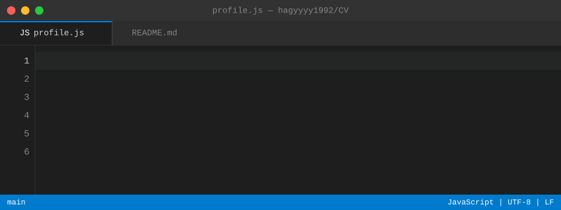

# 職務経歴書

<p align="center">
  
</p>

<!-- START doctoc generated TOC please keep comment here to allow auto update -->
<!-- DON'T EDIT THIS SECTION, INSTEAD RE-RUN doctoc TO UPDATE -->

- [SNS情報](#sns%E6%83%85%E5%A0%B1)
- [概要](#%E6%A6%82%E8%A6%81)
- [経験スキル](#%E7%B5%8C%E9%A8%93%E3%82%B9%E3%82%AD%E3%83%AB)
- [これまでの経験・実績](#%E3%81%93%E3%82%8C%E3%81%BE%E3%81%A7%E3%81%AE%E7%B5%8C%E9%A8%93%E3%83%BB%E5%AE%9F%E7%B8%BE)
- [貢献しやすいこと](#%E8%B2%A2%E7%8C%AE%E3%81%97%E3%82%84%E3%81%99%E3%81%84%E3%81%93%E3%81%A8)
- [条件面](#%E6%9D%A1%E4%BB%B6%E9%9D%A2)
- [キャリアタイムライン](#%E3%82%AD%E3%83%A3%E3%83%AA%E3%82%A2%E3%82%BF%E3%82%A4%E3%83%A0%E3%83%A9%E3%82%A4%E3%83%B3)
- [法人経歴](#%E6%B3%95%E4%BA%BA%E7%B5%8C%E6%AD%B4)
  - [2025/5 - 現在 | Hagyyyy株式会社](#20255---%E7%8F%BE%E5%9C%A8--hagyyyy%E6%A0%AA%E5%BC%8F%E4%BC%9A%E7%A4%BE)
  - [2026/2 - 現在 | 採用・仕事体験プラットフォーム](#20262---%E7%8F%BE%E5%9C%A8--%E6%8E%A1%E7%94%A8%E3%83%BB%E4%BB%95%E4%BA%8B%E4%BD%93%E9%A8%93%E3%83%97%E3%83%A9%E3%83%83%E3%83%88%E3%83%95%E3%82%A9%E3%83%BC%E3%83%A0)
- [フリーランス経歴](#%E3%83%95%E3%83%AA%E3%83%BC%E3%83%A9%E3%83%B3%E3%82%B9%E7%B5%8C%E6%AD%B4)
  - [2024/9 - 2026/1 | 介護・医療事業所向け請求管理SaaS](#20249---20261--%E4%BB%8B%E8%AD%B7%E3%83%BB%E5%8C%BB%E7%99%82%E4%BA%8B%E6%A5%AD%E6%89%80%E5%90%91%E3%81%91%E8%AB%8B%E6%B1%82%E7%AE%A1%E7%90%86saas)
  - [2024/2 - 2024/8 | 介護領域の求人推薦サービス](#20242---20248--%E4%BB%8B%E8%AD%B7%E9%A0%98%E5%9F%9F%E3%81%AE%E6%B1%82%E4%BA%BA%E6%8E%A8%E8%96%A6%E3%82%B5%E3%83%BC%E3%83%93%E3%82%B9)
- [正社員経歴](#%E6%AD%A3%E7%A4%BE%E5%93%A1%E7%B5%8C%E6%AD%B4)
- [登壇](#%E7%99%BB%E5%A3%87)
- [執筆](#%E5%9F%B7%E7%AD%86)

<!-- END doctoc generated TOC please keep comment here to allow auto update -->

## SNS情報

```json
{
  "FullName": "萩原圭市(Keiichi Hagiwara)",
  "GitHub": "https://github.com/hagyyyy1992",
  "Web": "https://www.hagyyyy.me/",
  "Company": "https://hagyyyy.com/",
  "Facebook": "https://www.facebook.com/hagyyyy1992",
  "Wantedly": "https://www.wantedly.com/id/hagyyyy"
}
```

## 概要

2017年からWebアプリケーション開発に携わり、**TypeScript・Python・PHPを用いたバックエンドを主軸に、要件整理からDB・API設計、画面実装、テスト、リリース・運用改善まで**担当してきました。請求・入金管理などデータの整合性が求められる業務機能、求人推薦サービスの検索データ整備、大規模データ処理の経験があります。

直近の採用・仕事体験プラットフォームでは、営業上の課題を起点にブロックエディタを提案。方式・費用・運用負荷の比較と試作から、**30種類以上のブロックを備えたエディタの実運用・顧客提供**まで進めました。Claude Code・Codexを日常的に活用し、要件の具体化、AIへの実装指示、テストと実画面での確認、修正・リリースまで対応しています。

GVA TECHではリードエンジニア・PMとして新規サービスの立ち上げ、開発体制の整備、採用・育成を担当。業務委託でも、テックリード不在時のリリース準備やチーム連携を代行してきました。事業側との対話を通じて背景や制約を理解し、実際に提供・運用できる形へ落とし込むことを大切にしています。

2021年に副業として業務委託を開始し、同年9月から独立して稼働を拡大。2025年5月に[Hagyyyy株式会社](https://hagyyyy.com/)を設立し、**Web開発支援と自社アプリの開発・運営**を行っています。代表自身がエンジニアとして開発に入ります。

最終更新：2026年10月10日

## 経験スキル

**バックエンド**

<a href="https://www.typescriptlang.org/"></a>
<a href="https://expressjs.com/"></a>
<a href="https://nestjs.com/"></a>
<a href="https://www.python.org/"></a>
<a href="https://fastapi.tiangolo.com/"></a>
<a href="https://www.php.net/"></a>
<a href="https://laravel.com/"></a>
<a href="https://cakephp.org/"></a>

**フロントエンド**

<a href="https://react.dev/"></a>
<a href="https://nextjs.org/"></a>
<a href="https://vuejs.org/"></a>
<a href="https://nuxt.com/"></a>

**DB/データ**

<a href="https://www.mysql.com/"></a>
<a href="https://www.prisma.io/"></a>
<a href="https://www.mongodb.com/"></a>

**LLM連携・検索**

<a href="https://openai.com/"></a>
<a href="https://qdrant.tech/"></a>

**インフラ/運用**

<a href="https://www.docker.com/"></a>
<a href="https://aws.amazon.com/"></a>
<a href="https://www.terraform.io/"></a>
<a href="https://sentry.io/"></a>

**テスト/品質**

<a href="https://playwright.dev/"></a>
<a href="https://jestjs.io/"></a>

**AI活用・開発改善**

<a href="https://docs.anthropic.com/en/docs/claude-code"></a>
<a href="https://git-scm.com/docs/git-worktree"></a>

Azure OpenAI API・Qdrantでは、検索データの取得・加工・登録更新とAPI改修を担当。Terraformは自社サービスで導入・運用しており、業務委託案件では未使用です。AI開発ツールはClaude Codeに加えてCodexも利用しています。

## これまでの経験・実績

- **提案から顧客提供まで**：営業課題を基にブロックエディタを提案し、方式比較・試作・既存データ移行から制作業務での実運用まで担当。
- **複雑な業務ルールの具体化**：登記手続き、請求・入金、カレンダー・参加費管理などを、データモデル・API・画面・帳票へ反映。
- **データ整合性を保つ設計**：入金・領収書・仕訳・請求更新を、ユースケース単位でまとめて成功・ロールバックできるトランザクション管理へ改善。
- **大量データと性能改善**：約30万行のCSV分割処理、約180万件の通知データ移行、SQL・インデックス改善による画面表示の約30秒から10秒以内への短縮。
- **0→1のサービス立ち上げ**：GVA TECHで企画段階から技術選定・開発・AWS構築・ローンチを担当し、継続開発の体制も整備。
- **開発と品質確認の両立**：Jest・Playwright・CIの整備に加え、チームでの回帰テストを提案・運用し、不具合の検知とリリース判断につなげた経験。
- **AIを活用した開発手順の整備**：カスタムスキル・Git Worktree・複数エージェントを活用し、実装、レビュー、動作確認、修正、リリースの反復手順を整備・共有。
- **チーム運営・採用**：スクラム導入・運用、事業側との開発計画調整、1チームで3プロダクトの開発マネジメント、3名のエンジニア採用を経験。
- **顧客のセキュリティ確認への対応**：実構成の調査、チェックシート・個人情報取扱業務フロー図の作成、WAFの設定是正や運用資料の整備。

## 貢献しやすいこと

- TypeScript・Pythonを中心としたSaaSのバックエンド開発と、必要に応じた画面実装・API連携
- 仕様が固まりきっていない段階での課題整理、方式比較・試作を通じた関係者との合意形成
- 請求・入金などの業務ルール、権限制御、データ移行を踏まえたDB・API設計と既存機能の改善
- 新規サービスの立ち上げから、顧客提供・運用・継続的な機能改善までの開発支援
- Claude Code・Codexを活用し、テスト・実画面での検証を組み合わせながら開発を進めること
- 開発手順の文書化・自動化、レビュー・回帰テストの運用、チーム内の情報共有

## 条件面

Hagyyyy株式会社としての法人契約（準委任契約）、フルリモートで対応しています。代表自身が開発に参画します。<br>
2026年11月から長期・フルタイムで参画できる案件を探しています（10月中の開始も相談可能）。AI開発ツールを活用できる環境を希望しています。<br>
より具体的な条件・単価感はソースコードのコメントアウトの方に記載しました。

<!--  
  希望単価: 時給4,000~8,000円 or 月64万〜128万（税別）
  平日週5フルタイム想定です。
  上限価格は直近案件で契約していた単価を根拠としてますが、スキル見合いでご予算感をご相談ください。

  単価のイメージは以下です。
  スキル経験マッチ度が非常に高く他を辞退して即日でぜひ来て欲しい→即決価格として8,000円
  スキル経験マッチ度が高いが他とも比較してよかったら来て欲しい→6,000~7,000円で検討します
  スキル経験に不足があり、他候補者と比較した時に、単価を下げれば来て欲しい→下限4,000円~5,000円まで検討できます
-->

## キャリアタイムライン

```text
2026 ━━ 💼 採用・仕事体験プラットフォーム - 法人として開発支援
  │
2025 ━━ 🏢 5月 Hagyyyy株式会社設立 - Web開発支援・自社アプリの開発・運営
  │
2024 ━━ 💼 介護領域の求人推薦サービス / 請求管理SaaS
  │
2023 ━━ 💼 IPO支援SaaS
  │
2022 ━━ 💼 ナレッジ経営 / カスタマーサクセス / 店舗接客 / 空き情報の各SaaS
  │
2021 ━━ 💼 リモートワーク / 店舗情報管理 / 学生就活 / 水産業支援の各サービス
  │       ── 1月 副業で業務委託開始・9月 独立して稼働拡大 ──
  │
2020 ━━ 🏢 合同会社DMM.com - オンラインサロン
  │
2018 ━━ 🏢 GVA TECH株式会社 - AI-CON登記
  │
2017 ━━ 🏢 株式会社ROBOT PAYMENT - 請求管理ロボ
```

## 法人経歴

### 2025/5 - 現在 | Hagyyyy株式会社

- 代表取締役／フルスタックエンジニア
- Web開発支援と自社アプリの開発・運営。代表自身が要件整理から設計・開発・テスト・リリース・運用改善まで担当。
- 以下は法人契約での開発支援実績です。

### 2026/2 - 現在 | 採用・仕事体験プラットフォーム

**役割・体制**

- フルスタックエンジニア。PM1名・エンジニア3名の体制（2〜3月はエンジニア1名、4月から各自が独立した機能を並行開発）。
- Claude Code・Codexを活用し、事業側との要件整理、AIへの実装指示、実画面での検証、修正・リリースまで担当。

**営業課題を起点としたブロックエディタの提案・顧客提供**

- 企業向けデモでの表現力不足に対し、独自ブロック方式・外部SDK・個別制作を比較。拡張性、費用、運用負荷を整理し、動く試作品を提示して開発方針を合意。
- 保存データ、編集画面、利用者画面、既存リッチテキストからの移行まで開発。30種類以上のブロックを備えたエディタを制作業務へ導入し、顧客向けコンテンツの提供に活用。
- 他メンバーの接続作業に必要な基盤を先行提供し、追加表現・UI改善を並行する段階リリースを提案・実施。制作担当からの要望を受け、編集操作・視認性・端末別表示を継続改善。
- 回答分岐・クイズ・動画などの仕事体験へ拡張し、公開期限、進捗・回答管理、スコアCSVなど配信・運営機能も開発。

**AIフィードバック・対話機能の開発と品質改善**

- 仕事体験の回答に対するAIフィードバックを拡張。プロンプト・生成結果の組み込み、コース単位の設定、回答形式への対応、管理画面での確認機能を開発。
- 無意味な入力にも具体的な内容を褒める結果が返るという指摘に対応。短文の正当な回答まで除外する誤判定リスクを説明し、5文字以下・同一文字列の連打・テスト用の特定文字列に対応対象を限定する方針を合意。
- 対象入力は提出を受け付けたうえでAI生成を省略し、固定の案内・評価を返す処理を開発・動作確認し、本番へ反映。
- 対話型ロールプレイ、アバター・メンター機能を開発。複数サービスや表現方式の費用を比較し、追加費用を抑える静止画方式を提案。専用ページの音声対話とコース内のテキスト対話を利用場面に応じて具体化。

**採用ナビ・情報交換サービスの横断開発と仕様調整**

- 採用ナビの検索、企業・コース閲覧、応募、マイページを改修。コミュニティの登録・投稿・情報交換・選考管理を継続開発し、商品構造・申込単位の変更に合わせてDB・API・画面を調整。
- 情報カードの一覧性やポイントの見せ方について、比較画面・PDF・スクリーンショットを提示。PC・スマートフォンの実画面でレビューを受け、関係者の認識を合わせて開発。
- レビュー時の追加要望は当初範囲のリリースと後続開発に分け、変更範囲・提供順序を調整。登録から情報交換までの導線改善では、手順削減と初回利用者の理解を助ける説明を提案。

**AIを活用した開発手順と品質確認の整備**

- Issue整理、実装、テスト、レビュー、リリースの反復手順をカスタムスキル・ルールとして整備。Git Worktreeで作業を分離し、複数エージェントによる開発・検証を並行。
- Jest・Playwrightによる自動テストとCIを整備。実装担当とは別のAIによる検証と、自身による実画面確認を組み合わせ、指摘修正・再確認を経てリリース。
- コード生成の進捗と本人確認の完了を分けて共有。認証情報・本番DBの扱い、対象環境の確認、調査記録を文書化し、CLAUDE.md・オンボーディング資料としてチームへ共有。

**基盤更新・保守運用・セキュリティ確認への対応**

- 旧バージョンによる追加開発の制約を整理し、事業側の優先機能・許容期間と調整。Node 25・Nuxt 4への移行、互換性修正・回帰確認から本番反映まで対応。
- ポイントだけが減る、通知が重複する、旧データの参照・表示が崩れるなどの不具合を、Sentry・実画面の報告から調査・修正。インフラ・DBの構成や運用・バックアップ手順も文書化。
- 顧客向けセキュリティチェックシートの回答に向けてAWS・アプリの実構成を調査し、回答資料と個人情報取扱業務フロー図を作成・提出。WAFの適用不足を是正し、追加対策の必要性・費用を責任者と調整。
- 会社サイトの不審な外部転送に対し、AIの説明を実ブラウザの挙動と照合して追加調査・復旧対応を進め、対応内容と残課題を記録。

**営業・運用支援と中長期の改善提案**

- 顧客説明用の詳細仕様資料を作成し、機能の対応範囲・制約を整理。利用規約・プライバシーポリシーの文案は法務担当の確認に向けて準備を支援。
- 非エンジニア向けのAI活用手順を文書化し、使い方を説明。構造の複雑化に対しては、業務ルールの分離と既存APIを稼働させながらの段階移行を提案し、改善Issue・試行PRを作成（工数縮小に伴い保留中）。

**使用技術**：TypeScript / Nuxt 4 / Vue 3（Composition API）/ Express / MongoDB（Mongoose）/ OpenAI API / Canvas API / Jest / Playwright / Claude Code / Codex

## フリーランス経歴

2021年1月から業務委託での開発支援に参画。初期は複数案件を並行し、2023年以降は上場企業を含む専門性の高い案件で、長期の継続支援に軸足を移しました。2021年1〜8月は正社員業務と並行した副業で、同年9月から稼働を拡大しています。

介護領域の2案件は、同じ企業内の2プロダクトです。以下の期間はそれぞれの**主担当期間**を示しています。

### 2024/9 - 2026/1 | 介護・医療事業所向け請求管理SaaS

**役割：バックエンドエンジニア**

請求・入金管理、レクリエーション管理、外部介護システム連携を担当。業務仕様の整理からDB・GraphQL APIの設計、画面実装・API連携、不具合修正まで対応しました。

**業務仕様を整理し、バックエンドから画面まで開発**

- レクリエーション機能の要件・仕様を整理し、DB・APIを設計。ConfluenceにAPI・GraphQL仕様を文書化し、フロントエンド担当とインターフェース・作業範囲を合意しながら開発を進めました。
- 毎日・毎週・毎月の繰り返し、予定の削除・複製に対応するカレンダーロジックを実装。参加者・参加費の請求仕訳と連携し、請求確定後の編集制限や請求状況の表示にも対応しました。
- フロントエンド担当の画面へのAPI連携に加え、不足していた画面を自身で引き取り、機能として完成させました。

**請求・入金業務の例外条件とデータ移行に対応**

- CSV/TXT・全銀フォーマットによる入金データの取込・照合・登録、未入金残高のDB・API・CSV出力、ファクタリング請求の未入金額の自動繰越を実装しました。
- 消費税・軽減税率、0円明細の除外、一括請求先の親子関係と合算、退去精算後の出力条件など、請求業務の条件分岐を処理・帳票に反映しました。
- PDFのアップロード・保存・請求書添付・設定画面を実装。家賃・管理費・食費の固定費マスターへの移行では、既存データの移行と請求書発行・仕訳処理の変更を担当しました。

**入金・領収書・仕訳を一体で扱うトランザクション設計**

- リポジトリごとに閉じていたトランザクションを、ユースケース単位で制御する設計へ変更。後続処理の失敗で入金だけが残る不整合を防ぐため、入金・領収書・仕訳・請求更新をまとめて成功・ロールバックできる処理を実装しました。
- トランザクション管理をインターフェースで抽象化し、DBアクセスと業務処理の責務を分離。同時リクエストでの共有を避けるため、TransactionClientを明示的に受け渡す方式を選定しました。
- 分離レベル・タイムアウト設定のトレードオフを検討。処理途中で意図的にエラーを発生させ、関連データがロールバックされることを検証し、テスト・モックも修正しました。

**外部連携・性能改善と、仕様が曖昧な段階での開発推進**

- 請求・入金・欠食・施設利用情報等の外部連携を実装。Shift-JIS・CRLF・項目数など相手システムのファイル仕様、本出力・仮出力、連携状態の管理をDB・API・画面に反映しました。
- 一覧の表示遅延やデータ出力時のタイムアウトを調査・修正。請求・入金・帳票間のデータ不整合にも継続して対応しました。
- 仕様が固まりきっていない依頼にはCopilotを活用してプロトタイプを先行作成し、関係者との認識合わせと実装方針の合意につなげました。納期対応が課題となった開発では、オンラインで相互確認する作業方法を提案し、チームの協力を得ながら対応を進めました。

**使用技術：** TypeScript / NestJS / GraphQL / React / Next.js / MySQL / Prisma / Clean Architecture

### 2024/2 - 2024/8 | 介護領域の求人推薦サービス

**役割：バックエンドエンジニア／テックリード不在期間の開発推進を代行**

LINEから入力された希望条件に基づき、LLM・ベクトル検索で求人を推薦するサービスの新規立ち上げに参画。DB設計、求人データの取得・加工、検索用データの登録・更新、LINE連携APIの改修を担当しました。

**検索データとAPIの整合性を改善**

- Azure OpenAI API・Qdrantを利用する求人検索で、LINE側からQdrantを呼び出すAPI処理を改修。スクレイピングで取得した求人・事業所情報の整形と、MySQL・Qdrantへの登録・更新処理を開発しました。
- 事業所名のベクトル化対象への追加、職種情報のpayload修正、DBとQdrant間の不整合への対応、掲載終了データの扱いを整備。検索件数のログ追加や検索処理の不具合修正にも対応しました。

**約30万行のCSVを扱うバッチ処理を実装**

- メモリ不足による処理停止を避けるため、S3のCSVを一時ファイルに保存し、1万行単位で読み込み・処理・メモリ解放する方式を実装。型の揺れや欠損値にも対応し、大量データを分割処理できる構成にしました。
- API仕様の可視化、型定義との相性、非同期処理のサポートを理由にFastAPIを選定し、既存Python処理へ接続。スクレイピング・バッチ・DB処理のテストと、PrismaからのER図生成・関連ドキュメントも整備しました。

**テックリード不在時のリリース準備とチーム連携**

- 正社員テックリードの急な休みに伴い、不在期間の開発推進を代行。リリースまでの残作業・対応順序を整理し、修正と仕様検討・進捗確認のミーティングを担当しました。
- 復帰後の引き継ぎを見据え、議論・決定事項・残課題を記録。AIエンジニアとのタスク調整、フロントエンドのPRのコード・動作確認レビューを行い、開発の継続を支えました。
- デプロイフローの自動化やログモニタリングなどの不足を整理し、インフラ担当者と改善内容を調整しました。

**使用技術：** Python / FastAPI / MySQL / Prisma / Azure OpenAI API / Qdrant / Selenium / Beautiful Soup / LINE Messaging API

<details>
<summary>2023/2 - 2023/4 | IPO支援SaaS</summary>

**役割：フロントエンドエンジニア**

- バックエンドAPIと連携し、カテゴリ・タスクのライブラリ一覧・詳細画面を構築。カテゴリの切り替えと選択状態の表示に対応しました。
- タスクの追加・解除をAPIと連携し、成功時のデータ再取得で画面状態を更新。重複していた取得処理も整理しました。
- 通知一覧、未読バッジ、未読のみの絞り込み、既読更新を実装し、操作後の状態を共通レイアウトへ反映しました。
- SvelteKitのサーバー側データ取得・API中継で、受信したAuthorizationヘッダーをバックエンドへ引き継ぐ実装を複数画面へ展開しました。
- 日付入力の日本語表示・書式・選択後の動作を調整。依存ライブラリの対応範囲を確認し、日付入力用のdate-picker-svelteへ切り替えました。

**使用技術：** TypeScript / Svelte / SvelteKit

</details>

<details>
<summary>2022/11 - 2024/1 | ナレッジ経営SaaS</summary>

**役割：バックエンドエンジニア**

- Microsoft Graph APIによるTeamsチャット通知を実装。OAuth認証・連携解除、アクセストークン更新、質問・メモ・返信に応じた通知内容の生成・送信に対応しました。
- お知らせ表示をReact画面・GraphQL APIに実装し、配信期間・ユーザー別の表示状態を管理。匿名投稿の既読・リアクション・返信通知では、実ユーザーIDと表示用IDの使い分けを修正しました。
- CSVによるユーザー一括更新の権限検証を改修。管理者の削除・降格と他ユーザーの昇格・再開が混在しても、有効な管理者が0人にならないよう画面・APIの判定を整備しました。
- 通知データのDB変更に合わせ、テナントごとのPython移行スクリプトを実装。移行失敗時に旧カラムの削除をスキップする処理を追加し、管理権限データの移行にも対応しました。
- 集計処理をEntity・Collection・Query・DataLoaderに整理し、識別子にValue Objectを導入。ユーザー一括更新では個別SQLを一括取得と辞書参照へ変更し、繰り返しのDBアクセスを削減しました。
- 操作ログの期間指定をタイムゾーン付きRFC3339形式へ修正。ストリーム保存の失敗検知と利用者へのエラー表示も追加しました。

**使用技術：** Python / TypeScript / Node.js / React / Next.js / NestJS / GraphQL / Apollo

</details>

<details>
<summary>2022/7 - 2022/10 | リアルタイム空き情報プラットフォームSaaS</summary>

**役割：バックエンドエンジニア**

- CSVデータをSQLへ変換し、一括登録できるスクリプトを実装しました。
- 施設・エリア別の広告配信除外カテゴリをCSVで出力・一括更新する管理画面とAPIを開発。列数、ID形式・重複、対象施設との一致を取込時に検証しました。
- 広告レポートの期間指定を集計・グラフ・CSV出力へ反映。境界日の集計、日付の逆転、データがない期間の表示も修正しました。
- 広告一覧に階層セグメントの選択UIと検索条件を追加。子要素の再帰的な候補表示、複数選択の状態管理、API側の絞り込みを実装しました。

**使用技術：** TypeScript / Vue.js / Node.js

</details>

<details>
<summary>2022/5 - 2022/10 | 店舗接客マネジメントSaaS</summary>

**役割：バックエンドエンジニア**

- スタッフのCSV一括登録画面・バックエンド処理を実装。入力検証と100件単位の非同期登録に加え、所属チェーン外の店舗・既存メールアドレスの除外、ライセンス数更新・案内メールとの連携に対応しました。
- アンケートのコピーを複数店舗へ拡張。店舗検索・複数選択UIと、設問・セクション・分岐条件の関連IDをコピー先ごとに付け替える処理を実装しました。
- S3画像の配置変更に向け、オブジェクトのコピーとDB参照パスの移行スクリプトを作成。1,000件単位のトランザクション、例外時のロールバック、移行前のパスへ戻す処理に対応しました。
- 開発環境のS3バケット分離に合わせ、バケット間コピーと環境別の参照先切り替えを実装。画像保存・取得の既存テストも修正しました。

**使用技術：** PHP 8.0 / CakePHP 2 / Vue.js 2 / TypeScript

</details>

<details>
<summary>2022/3 - 2023/6 | カスタマーサクセスSaaS</summary>

**役割：バックエンドエンジニア**

- 投稿・コメントの承認待ち／承認／却下を管理するAPI・画面を開発。企業ごとの承認要否に応じた初期状態、DB項目追加、状態変更の機能テストに対応しました。
- ライター権限の招待・変更画面、メニュー表示、サーバー側ミドルウェアのアクセス制限を実装。投稿タグ・フォロー、企業ごとのコミュニティ表示設定も開発しました。
- アンケートの数値評価・自由記述の設問を追加・編集・削除する機能を、Vue.jsの設定画面からLaravel API・入力検証・DB変更・機能テストまで実装しました。
- 企業ごとのWebhook設定に基づくアンケート回答のSlack通知を実装し、通知先・対象の設定画面、設定保存、通知処理を連携しました。
- 動画再生数の期間・ユーザー別・日別集計と会員登録日時のCSVレポートを開発。集計クエリ、出力処理、画面からの選択、機能テストを追加しました。
- 動画・メディアの埋め込み／添付を切り分けるエディタを実装し、DOM操作の不具合も修正。Dockerの開発環境にはXdebugとエディタのデバッグ設定を整備しました。

**使用技術：** PHP 7.4 / Laravel 6 / Vue.js 2

</details>

<details>
<summary>2021/11 - 2022/2 | 水産業支援SaaS</summary>

**役割：バックエンドエンジニア / DevOps（単独担当）**

- React Nativeで氏名・メールアドレス・パスワードの変更画面とFirebase連携を実装。再認証、変更先メールアドレスの確認、認証メール再送に対応しました。
- Jest・Firebase Emulatorを導入し、養殖場・エサ・薬剤・作業記録等のFirestoreアクセスルールを検証。認証済みユーザーの取得・登録・更新と、未認証アクセスの拒否を確認するテストを追加しました。
- GitHub Actionsで、push時にFirebase Emulator上のJestテストとESLint・Prettierチェックを実行するCIを構築しました。
- Expoによる環境構築・実機確認・ステージング検証の手順をREADMEに整備。変更内容と実施テストを共有するPRテンプレートも追加しました。

**使用技術：** TypeScript / React Native / Firebase

</details>

<details>
<summary>2021/10 - 2021/12 | 店舗情報一括管理SaaS</summary>

**役割：バックエンドエンジニア**

- 「質問と回答」画面の性能改善を担当し、**表示時間を約30秒から10秒以内へ短縮**しました。
- EXPLAINでSQL実行計画を調査し、社内エンジニアへ課題を共有・相談しながら改善。会社・店舗の権限条件を踏まえ、事前取得した店舗IDでの絞り込みをJOINへ変更し、初期表示時の不要なデータ取得を抑制しました。
- 関連レコード取得に用いる列へインデックスを追加し、Laravelのマイグレーションで適用・ロールバックを実装しました。
- 不具合・要望対応と、フォームの空欄時にエラーを表示するバリデーションを実装しました。

**使用技術：** PHP / Laravel

</details>

<details>
<summary>2021/6 - 2021/9 | グローバル学生就活オンラインサービス リメイク</summary>

**役割：フルスタックエンジニア**

- 投稿詳細、コメント、いいね・取消、回答評価をNuxt.js・Laravelの両側で実装。件数・評価状態の画面反映と操作履歴の保存にも対応しました。
- イベント申込完了画面のレスポンシブ対応と、未ログイン時のコメント・評価操作でログインを案内する画面制御を実装しました。
- 通知設定の取得・保存APIと設定画面を開発。設定が未作成の既存ユーザーへ初期値を補うデータ移行コードも作成しました。
- メールアドレス・パスワード変更画面とAPI連携を実装。入力検証、現在のパスワード照合、エラー表示まで対応し、Postmanでリクエスト・レスポンスを確認しながら開発を進めました。

**使用技術：** TypeScript / Nuxt.js / PHP / Laravel / Postman

</details>

<details>
<summary>2021/1 - 2021/12 | リモートワークSaaS</summary>

**役割：フルスタックエンジニア / スクラムマスター**

2021年1〜8月はDMMでの正社員業務と並行した副業として参画し、9月から稼働を拡大しました。

- Vue.js・FirebaseによるDM機能を実装。データ変更イベントを使ったリアルタイム受信、ユーザー別の既読記録・未読数表示に対応しました。
- Node.jsのSlack通知と、通知から対象のDM・トピックを開く画面遷移を実装。複数人DMで意図しない会話を開く不具合を、会話ルームIDを引き継ぐ方式へ変更して修正しました。
- カスタムステータスの設定画面・保存処理、文言の入力履歴、有効期限後の切り替え、Firebaseのデータ検証ルールを実装しました。
- テスト仕様書の作成・リリース前テストを実施。PRテンプレートに実施テスト・テストコード・POレビュー・仕様書更新の確認欄を設け、確認状況を共有できる開発フローを整備しました。
- スクラムの説明資料作成、ミーティング進行、スプリントテスト、振り返りを担当。スプリントの目標・成果を共有し、POからも把握しやすくなったとの評価を得ました。
- 言語リプレイス、クリーンアーキテクチャ、技術的負債の議論をファシリテートし、課題・論点を記録しました。

**使用技術：** Vue.js / Node.js / Firebase

</details>

## 正社員経歴

<details>
<summary>2020/5 - 2021/8 | 合同会社DMM.com / オンラインサロン</summary>

**役割**：バックエンドエンジニア。PHPを中心に、React側の改修、調査、テスト、リリースまで担当。

**機能改修・大量データ移行と不具合調査**

- 通知設定の仕様変更に伴うキュー処理を改修し、テスト・ステージング検証・デプロイまで対応。約180万件の本番データを10万件単位で分割更新。
- 支払データ出力時の異常終了をログから調査。CTO室と連携してORMのキャッシュ管理に原因を絞り込み、キャッシュ解放処理の追加で解消。
- サロンIDと投稿IDの対応が崩れる表示不整合に対し、APIのルーティングとReact側のリクエストを修正。テスト追加からリリースまで担当。
- 強制退会ユーザーの再入会を防ぐ会員管理仕様を実装・リリースし、過去データへの対応も実施。

**外部連携・認証設計とチームの開発基盤**

- Zoom連携の導入検討で、要求整理・詳細設計、事業・デザイン・開発側との仕様・役割調整を担当。本番公開に必要な審査要件と実現上の課題を整理・共有。
- マイクロサービスの認証・認可のベストプラクティスを調査・設計。アカウント移行の設計・実装とデータマイグレーション方針を検討し、会社主催イベントでも取り組みを発表。
- 既存DBスキーマからDB定義書を作成。Makefileによる環境構築の自動化、Xdebug導入・手順の文書化、IDEの活用方法の共有を実施。
- スクラムのファシリテーション、ペアプロ・モブプロの提案・実施を担当。

**リリース前の回帰テスト運用の立ち上げ**

- 2週間のスプリントに、主要機能を横断して確認する工程がないことを課題化。テスト仕様書を作成して試行し、2週間に一度チームで確認する回帰テストを継続運用。
- 利用頻度の低い機能の重大な不具合や、当該スプリントの変更による既存機能への影響をリリース前に検知。変更の差し戻し・次スプリントへの延期など、品質を踏まえたリリース判断につなげた。

**使用技術**：PHP（Laravel, ZendFramework）/ TypeScript / React / MySQL / Docker / AWS

**この経験で得たこと**：自己組織化したスクラムチームでの意思決定と、リモート環境での情報共有を経験。機能開発と既存利用者への影響確認を両立する開発フローを学びました。

</details>

<details>
<summary>2018/9 - 2020/4 | GVA TECH株式会社 / AI-CON登記</summary>

**役割**：リードエンジニア / PM。企画段階から参画し、技術選定・要件整理・開発・AWS構築から2019年1月のローンチ、継続開発・チーム運営まで担当。

**新規プロダクトの立ち上げと専門業務の要件化**

- 経験レベルの異なるメンバーの参画を想定し、「設定より規約」を重視してPHP・CakePHPを選定。Docker・Makefile・Xdebugによる開発環境とAWS EC2・ALB・VPC・Route53・CloudWatch等のインフラを整備。
- 登記業務を自ら学習し、司法書士と入力情報・出力書類の対応関係を整理。専門資料を実装に必要な要件へ具体化し、仕様認識を合わせながら開発。

**登記機能・株主名簿と購入書類管理**

- 募集株式発行（増資）の登記機能を開発。会社の機関設計、決議方法、引受人と役員の関係、発行可能株式数に応じた入力制御・手続き案内・必要書類の選択と、議事録・申請書等の生成を実装。
- 株主名簿のExcel取込、Web上での表形式編集・保存を実装。会社名の表記ゆれ、和暦・全角数字、自己株式、株数の整合性を扱う入力検証を整備し、登記書類の作成フローへ接続。
- 購入履歴と生成書類を分けて管理し、書類の編集、PDF・ZIP再生成、S3保存、購入後画面・マイページからの再取得を開発。所属企業を確認するダウンロード条件も整備。
- 登記種別ごとに重複していた書類生成・配布処理を共通化。業務条件による書類選択とPDF生成・ZIP化・S3保存を分離し、手続き追加・書類編集に対応しやすい構成へ改善。

**決済・会員管理・外部サービス連携**

- PAY.JP連携の決済処理を共通化し、保存カード管理、管理画面からの返金、返金履歴を実装。決済APIとDB更新の成否を区別し、購入・返金状態に応じた処理を整備。価格・税率をAPI側へ集約し、消費税率変更にも対応。
- 書類購入後の郵送オプション・発送依頼、登記情報取得代行の受付を実装。送付先・申請予定日・依頼状況の管理、利用者・運営への通知、購入プランに応じた案内まで接続。
- Auth0とサービス内DBを連携した会員登録・メール認証・ログインを実装。別サービスの既存アカウントも考慮し、登録状態に応じたユーザー・会社情報の作成と画面案内を整備。
- 一般利用者と管理者のセッションを分離し、社内管理画面の認証、ユーザー・企業・購入履歴・管理者アカウントの管理、登録状況・購入履歴件数の可視化を開発。
- マネーフォワード クラウドとのAPI連携の実装・検証を担当。事業所情報の連携、OAuthトークン管理、契約プランに応じた価格・決済経路の切替、月次課金データ送信を開発。

**品質改善・継続開発の基盤整備**

- 登記情報の読取・和暦変換・書類出力を横断する令和対応を実施。住所・氏名・文字化け等の例外を修正し、関連役員データのトランザクション更新とS3ファイル削除の条件も整理。
- 共通テスト仕様書を大型リリース前の検証とオンボーディングに活用。役員変更の新任・辞任に伴う約100パターンの業務条件をチームで検証し、修正からリリースまで対応。
- Backlog・GitHubフロー・CircleCI・ステージング環境・TDD環境を整備。非エンジニアもリリース前に確認する運用を導入し、要件認識のずれを早期に確認できる体制を構築。
- 複数プロダクトでの環境構築、DB初期化、テスト、デバッグをDocker・Makefileで定型化し、開発・本番別の設定と日常作業の手順を文書化。

**開発計画の調整・採用とチーム運営**

- 役員変更機能の3か月前倒し要望に対し、事業側の目的を確認。主要機能を毎月1件以上公開する代案を提案し、役員変更は当初予定を維持することで合意して開発計画を推進。
- 2019年11月〜2020年1月は、1チームで3プロダクトの開発マネジメントを兼任。週1〜月1の1on1、新規メンバーの相談・振り返り、見積もりの認識合わせ、OJT分担・後任への引き継ぎを整備。
- リファラル・Wantedly等を活用した採用活動に取り組み、3名の採用につなげた。

**使用技術**：PHP / CakePHP / Vue.js / MySQL / Docker / AWS / Auth0 / PAY.JP / CircleCI

**この経験で得たこと**：専門業務を理解してサービスとして形にすること、事業側の目的を踏まえて実現可能な計画を提案すること、採用・育成・引き継ぎまで含めた継続開発の体制づくりを経験しました。

</details>

<details>
<summary>2017/4 - 2018/8 | 株式会社ROBOT PAYMENT / 請求管理ロボ</summary>

**役割**：バックエンドエンジニア。要件定義書・詳細設計・実装・テスト仕様書・結合テスト・保守運用まで一貫して担当。

**請求業務のAPI開発と運用支援**

- 繰越API、請求書の発行・送付・郵送APIを開発・リリース。請求元部署・担当者の登録更新・停止削除APIにも対応。
- CS向けにAPI・SQLの調査手順を文書化し、リクエスト・レスポンスやDB確認方法をレクチャー。コード調査が不要な問い合わせをCSで一次対応できる体制を整備。

**採用・育成と社内表彰**

- エンジニア採用のイベント登壇、面談、リファラル、入社後フォローを担当。インターン2名の採用と、システム概要・開発環境を理解するためのOJTを実施。
- 採用広報の勉強会を集客から実施まで担当。19名の集客、2名の選考移行につなげた。
- 主体性・行動力・採用活動の実績が評価され、2018年4月に四半期で1名が選ばれるバリュー賞を受賞。

**使用技術**：PHP / CodeIgniter / MySQL / JavaScript / Docker / AWS ECS

**この経験で得たこと**：仕様変更への対応と、設計・テスト・レビューを通じた品質確認の両立が、その後の開発フローづくりの基盤になりました。1年目から採用・登壇に取り組み、開発以外でも組織へ貢献する経験を得ました。

</details>

## 登壇

|Date|Event| Link                                                                                                                                                                             |
|---|-----|----------------------------------------------------------------------------------------------------------------------------------------------------------------------------------|
|2021/02/24|歪なモノリシックアプリケーションをマイクロサービスパターンで未来につなげる話| [speakerdeck](https://speakerdeck.com/hagyyyy/wai-namofalserisitukuapurikesiyonwomaikurosabisupatandewei-lai-nitunageruhua) <br/> [logmi tech](https://logmi.jp/tech/articles/324514) |
|2019/06/18|あるあるLT〜サーバーサイドエンジニア〜 Vol.3| [slideshare](https://www.slideshare.net/ssuserde3f3f/hagiwara-ltpresentation-php-and-cakephp-150282990)                                                                          |
|2019/06/08|サービスリリースから安定軌道に乗せるまでに行った開発施策| [slideshare](https://www.slideshare.net/ssuserde3f3f/ss-149813668)                                                                                                               |
|2018/03/26|【大学生・大学院生限定！】AWS+Dockerハンズオン| [connpass](https://cloudpayment-sys.connpass.com/event/80092/)                                                                                                                   |
|2017/12/12|【大学生・大学院生限定！】Pythonを使ったWEBアプリケーションの作り方| [connpass](https://cloudpayment-sys.connpass.com/event/70358/)                                                                                                                   |

## 執筆

|Date|Title|Article|
|---|-----|---|
|2026/01|Prismaのトランザクション管理をリポジトリ層からユースケース層へ移行した設計改善|[hagyyyy.me.blog](https://www.hagyyyy.me/posts/prisma-transaction-refactoring-from-repository-to-usecase)|
|2026/01|AI駆動開発で技術ブログを構築 - Claude Code × Gemini の実践録|[hagyyyy.me.blog](https://www.hagyyyy.me/posts/ai-powered-tech-blog-development)|
|2018/05|Django x Docker|[qiita](https://qiita.com/hagyyyy/items/466b5bab67118175be65)|
|2018/03|Dockerでローカル開発環境を作り、AWS-ECSにデプロイする|[qiita](https://qiita.com/hagyyyy/items/959c115e0a5001972604)|
|2017/12|Python Djangoでherokuにデプロイしてみた|[qiita](https://qiita.com/hagyyyy/items/466b5bab67118175be65)|
